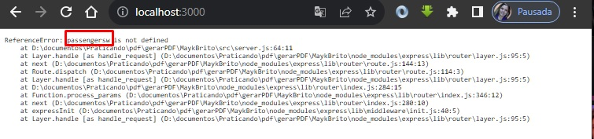

# Celke

Gerando PDF com PHP.

  

## :books: Material

Material usado para este conteudo: 

- VS Code
- PHP 7.4
- dompdf ( biblioteca)
- composer v2.3.10

## Requerimentos para o DOMPDF

* PHP version 7.1 ou superior
* DOM extension
* MBString extension
* php-font-lib
* php-svg-lib

## :card_file_box: pastas (caminhos)

- index.php
- gerar_pdf.php 

## :building_construction: Começando

Construir o arquivo index, onde deve constar um HTML, com um 'form' contendo inputs  para 'nome' e 'e-mail' e um textarea para 'descricao'. E o botão de submeter.

Construindo o arquivo que irá receber as informações ( gerar_pdf.php );

Gerando o pacote inicial (terminal):

  

 

## :tada: Finalizado

Vídeo