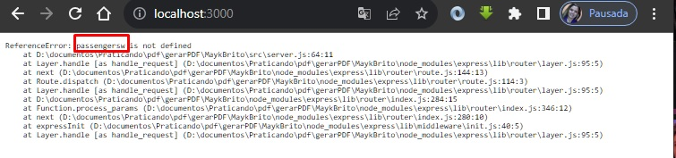
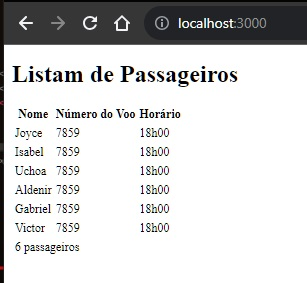
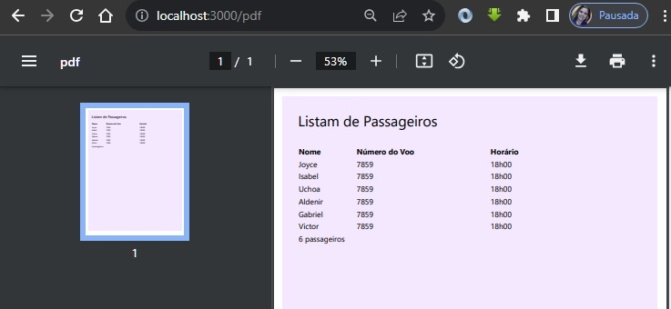

# Mayk Brito

Gerando PDF com NodeJS.

> [!WARNING]
> Sempre criar o gitignore antes de começar qualquer aplicação.

## :mag_right: Onde encontrar

Conteudo do video de Mayk Brito:
  * Localização: https://www.youtube.com/watch?v=AoU7aEdTldE
  * Titulo Vamos gerar PDF com NodeJS, Puppeteer, EJS e TailwindCSS
  

## :books: Material

Material usado para este conteudo: 

 - VS Code
	- Extensões:
		- Bracket Pair colorizer ( cores dos parenteses);
		- Launchbase Theme
		- Material Icon Theme
- NPM v9.6.6.
- node v18.16.0
- express ( ejs html-pdf)
- TailwindCSS 
- puppeteer

## :card_file_box: pastas (caminhos)

- src
	- server.js
	- print.ejs

## Informações passadas por Mayk Brito

### Como exportar um PDF com NodeJS

- [x] Pq eu preciso exportr um PDF?
- [ ] Existem outras ferramentas?
- [ ] Pq eu vou usar o NodeJS?

### O que vamos aprender aqui?
- [ ] NodeJS
- [ ] Criar um servidor com uma rota
- [ ] Usar um template engine
- [ ] Usar callbacks

### Bora codar?
 Iniciar o projeto com NPM
 Instalar dependenciasexpress ejs html-pdf
 Iniciar o servidor
 Criar uma rota da aplicação
 Entender request, response
 Primeiro entendimento de callback
 Está confuso sobre HTTP? Discover
 Criar uma lista de dados para criar o relatório
 Criar um HTML
 Mostrar na rota (tá curtindo? deixa o like plis)
 Enviar dados para o HTML (template engine)
 Segundo entedimento de callback
 Utilizar o html-pdf e configurar as opções
 Callback de novo?
 Gerar o arquivo

### Bônus
 Melhorar o estilo do PDF
 Utilizar o puppeteer
 criar uma nova rota para exportação
 iniciar o puppeteer (headless)
 iniciar a página
 ir para URL (aguardar toda a página ser carregada)
 configurar e gerar o pdf
 fechar o browser
 configurar o tipo de conteúdo da rota como application/pdf
 exportar o PDF

### Próximos passos
- [ ] Revise seu código e tente lembrar o que cada coisa faz
- [ ] Crie uma nova ideia de exportação de PDF, baseado nesse modelo
- [ ] Comente o que achou :)

## :building_construction: Começando

Gerando o pacote inicial (terminal):

	npm init -y 
	
Irá gerar dentro do diretório que estamos trabalhando o `package.json` que é a configuração do projeto;

Instalando as dependências (terminal):

	npm install express ejs html-pdf
	
Express é uma ferramenta para criar um servidor. Criará as rotas que iremos utilizar. 

Criando a pasta principal `src` e dentro dela o servidor `server.js`;

Iniciar o servidor (terminal):

	node src/server.js
	
	
O servidor começa, mas não avisa nada. 
Mas tem como verificar se o servidor esta logado, simplesmente verificar o  `localhost:3000`;

  

Configurar a rota inicial;
No meu caso eu tive de reiniciar o servidor para obter a resposta constante na rota. 

Tentativas de refresh automático do servidor (terminal):

	npm install -g nodemon
	
	npm install --save-dev nodemon
	
Agora toda a vez que reiniciar o navegador, será com o comando:
	
	npm start 

Callback -> função que é passada como argumento para outra função;

Criar a lista de dados que será passada para a pagina que constará no relatório; 

Passar a variável de passageiros para o servidor e verificar a informação. 

Criar o arquivo `print.ejs` , ejs é uma template end;

Inicio de tags em ejs são representados por `<%` e o fechamento destas tags por `%>` ;

ejs permite adicionar códigos javascript no meio de HMTL sem adicionar `script` ;

Passar as informações dos passageiros do servidor para dentro do arquivo ejs;
Importar no arquivo do servidor ( src/server.js) o framework ejs ;

Pegar o caminho correto do arquivo;

Função `renderFile` do ejs;
Esta função recebe três parâmetros: caminho, objeto e callback;

Exemplos de objeto (chave e valor): 
 * {'passageiros': passengers} ( no ejs, usariamos 'passageiros');
 * {'passengers': passengers}
 * { passengers}

Todos estão corretos, são formas diferentes de apresentar a mesma informação; 

Forçando um erro para mostrar a mensagem de erro, neste caso trocado o nome do Objeto que será passado.

  

 

Trocando o caminho que será buscado:

  

Neste caso irá trazer a informação que indicamos  para ser mostrada. 

Callback não é executado imediatamente,  a aplicação continua rodando. E o callback ( chame de volta ) depois da aplicação finalizada, o sistema guarda esta parte do callback em separado, roda toda a função , podendo ter encontrado o que queriamos, e depois roda o callback, podendo retornar com um falso negativo/positivo.

A execução do arquivo só poderá acontecer se houver um resposta possitiva da execução ( não houver erro );

Mostrando o HTML

  

 

Chamando o Módulo de PDF;

Realizada as configurações e gerado o arquivo em pdf ( report.pdf) foi gerado na pasta raiz do projeto, sem solicitar para abrir. 

O PDF ficou sem as informações do CSS. Mas esta parte será adicionado na parte Bonus do video. 

Vamos usar  a biblioteca `tailwind` , que será adicionada com um link externo, dentro do html.

Onde encontrar: 

	https://tailwindcss.com/docs/installation/play-cdn
	
Documentação: 

	https://v2.tailwindcss.com/docs/hover-focus-and-other-states
	
Instalando o puppeteer:

	npm install puppeteer
	
Agora o arquivo apenas será enviado para o navegador. 

Criaremos a nova rota para o pdf, e dentro do servidor, iremos retirar o pdf dele. Retira as opções. E retira o pdf create.

Usando o `async` e o `await` , para haver a espera e o aguardo da função. Uma promessa que irá abrir o navegador. 

No browser iremos chamar a nova rota: 

	http://localhost:3000/pdf

A nova rota, por enquanto apenas apresenta o return ( 'Feito' );

Ele esta abrindo e fechando uma página do google chrome extra, não é uma aba, e sim uma página. 

Retirando o ` {headless: false }`  do lauch , ele ira trabalhar, sem abrir a página do google. Quando não tem nada, ele usa o default. O default dele é o `headless: true `  ou seja, faz a programação escondido, sem mostrar a página. 

Agora executando, tanto o localhost,  como o '/pdf'.
PDF sendo apresentado na tela: 

  

 

## :tada: Finalizado

Vídeo com aproximadamente 1hora e 20min de duração.
Trazendo conceitos novos (ejs, puppeteer, ...) e revisão de conceitos antigos (callback). 
Com necessidade de busca de outros conceitos( nodemon).

Ótimo conteudo, seguir a indicação de Mayk Brito, de refazer, brincar, reformar e produzir vários outros.

show de bola. 

