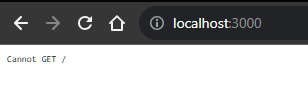

# Mayk Brito

Gerando PDF com NodeJS.

> [!WARNING]
> Sempre criar o gitignore antes de começar qualquer aplicação.

## :mag_right: Onde encontrar

Conteudo do video de Mayk Brito:
  * Localização: https://www.youtube.com/watch?v=AoU7aEdTldE
  * Titulo Vamos gerar PDF com NodeJS, Puppeteer, EJS e TailwindCSS
  

## :books: Material

Material usado para este conteudo: 

 - VS Code
	- Extensões:
		- Bracket Pair colorizer ( cores dos parenteses);
		- Launchbase Theme
		- Material Icon Theme
- NPM v9.6.6.
- node v18.16.0
- express ( ejs html-pdf)

## :card_file_box: pastas (caminhos)

- src
	- server.js

## Informações passadas por Mayk Brito

### Como exportar um PDF com NodeJS

- [x] Pq eu preciso exportr um PDF?

- [ ] Existem outras ferramentas?

- [ ] Pq eu vou usar o NodeJS?

### O que vamos aprender aqui?
- [] NodeJS
- [] Criar um servidor com uma rota
- [] Usar um template engine
- [] Usar callbacks

### Bora codar?
 Iniciar o projeto com NPM
 Instalar dependenciasexpress ejs html-pdf
 Iniciar o servidor
 Criar uma rota da aplicação
 Entender request, response
 Primeiro entendimento de callback
 Está confuso sobre HTTP? Discover
 Criar uma lista de dados para criar o relatório
 Criar um HTML
 Mostrar na rota (tá curtindo? deixa o like plis)
 Enviar dados para o HTML (template engine)
 Segundo entedimento de callback
 Utilizar o html-pdf e configurar as opções
 Callback de novo?
 Gerar o arquivo

### Bônus
 Melhorar o estilo do PDF
 Utilizar o puppeteer
 criar uma nova rota para exportação
 iniciar o puppeteer (headless)
 iniciar a página
 ir para URL (aguardar toda a página ser carregada)
 configurar e gerar o pdf
 fechar o browser
 configurar o tipo de conteúdo da rota como application/pdf
 exportar o PDF

### Próximos passos
- [] Revise seu código e tente lembrar o que cada coisa faz
- [] Crie uma nova ideia de exportação de PDF, baseado nesse modelo
- [] Comente o que achou :)

## :building_construction: Começando

Gerando o pacote inicial (terminal):

	npm init -y 
	
Irá gerar dentro do diretório que estamos trabalhando o `package.json` que é a configuração do projeto;

Instalando as dependências (terminal):

	npm install express ejs html-pdf
	
Express é uma ferramenta para criar um servidor. Criará as rotas que iremos utilizar. 

Criando a pasta principal `src` e dentro dela o servidor `server.js`;

Iniciar o servidor (terminal):

	node src/server.js
	
Tentativas de refresh automático do servidor

	npm install -g nodemon
	
	npm install --save-dev nodemon
	
	npm start 

	
O servidor começa, mas não avisa nada. 
Mas tem como verificar se o servidor esta logado, simplesmente verificar o  `localhost:3000`;

  

Configurar a rota inicial;
No meu caso eu tive de reiniciar o servidor para obter a resposta constante na rota. 

Callback -> função que é passada como argumento para outra função;

Criar a lista de dados que será passada para a pagina que constará no relatório; 

Passar a variável de passageiros para o servidor e verificar a informação. 

	 

## :tada: Finalizado

