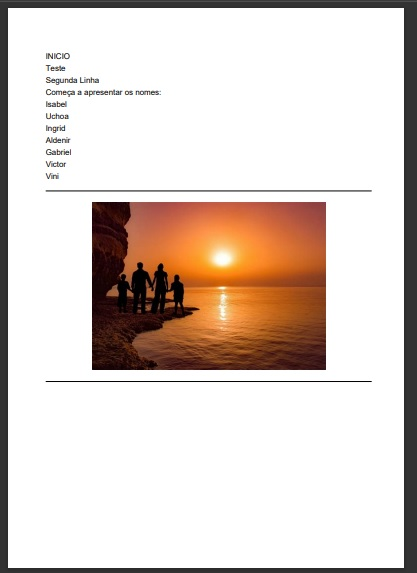

# PDF com Python

Vídeo: 

> Titulo: Gerando PDF com PYTHON

> Localização: https://www.youtube.com/watch?v=Pi94aWswimU

> Canal: pythonando

## Criando o ambiente

	
	[troca do terminal para powershell]
	cd p (tab)
	cd n (tab)
	python -m venv ambTeste
	
Criação automática das pastas(Dentro da pasta Nando):

-  :file_folder:  ambTeste
	- :file_folder: Include
	- :file_folder: Lib
	- :file_folder: Scripts
	- :pencil: pyvenv.cfg
	
## Ativando 

Para ativar o ambiente de trabalho do python: 

	source ambTeste/bin/activate 
	
(Lembrando que source é para ambientes Linux).

Sem resultado.

Realizado outras tentativas. Mas ainda sem resultado( necessário novas pesquisas de como trabalhar com python no windows);

## Instalando biblioteca(s)

	pip install reportLab
	
(Mesma biblioteca instalada no exemplo anterior).

## Trabalhando 

Gerar o arquivo app.py, dentro da pasta principal ( ambTeste );

Canvas usa o plano cartesiano ( eixos x e y );

Canvas usa pontos, e não milimetros. 

Uma folha A4 no canvas tem de EixoX: 595.275590 pontos e de EixoY: 841.889763 pontos.

### Função

Função python para transformar pontos em milimetros:

<code>
	def mm2p( milimetros):
		return milimetros / 0.352777
</code>

Na função do tamanho A4 os valores do EixoX está em 210mm  e do EixoY está em 297mm.

mm=cm*0.1

Usando o fórmula dele, deixei mais perto possivel e no momento de como usamos para gerar os PDF habitual ( como se fosse matriz);

Vou incrementar, um aviso em tela, para parar de escrever, quando chegar na parte do fim tanto do eixo X como do eixo Y .

<code>
	eixoX = mm2p(20)
	eixoY = mm2p(270)
	arq.drawString( eixoX ,  eixoY , 'INICIO ')
	linha = 20
	eixoY -= linha
	arq.drawString( eixoX ,  eixoY , 'Teste ')
</code>

Com os testes realizados até agora, o tamanho de linha estando em 10 fica muito colado um no outro. Portanto o 10 é o meu Limite mínimo.

Gerando Circulo.

Gerando Linhas:

	arq.line( eixoX, eixoY, (eixoX+490), eixoY)
	
Buscando Imagens:

<code>
	eixoY -= linha
	largura = 200
	altura=100
	arq.drawImage( ".\Include\img\sol_mar.jpg", eixoX, eixoY-altura, width=largura, height=altura)
</code>

Adicionando a imagem verificamos duas situações, no python a barra para encontrar os arquivos é inversa do que nos outros sistemas. E temos de cuidar a altura da imagem, para não adicionar em cima do texto que ja foi trabalhado. 

## :tada: Finalizado

Para um arquivo simples, é bem fácil didático  e até divertido de fazer. 

Mas devemos especificar melhor como adicionar as informações de quebra de linha na página. E o tamanho total da página. 

  

	

	

